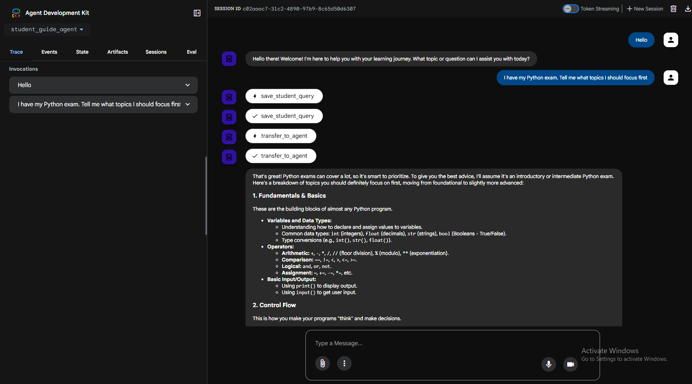
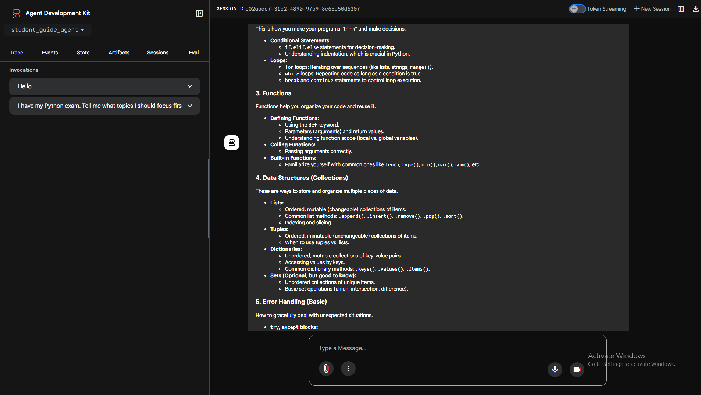
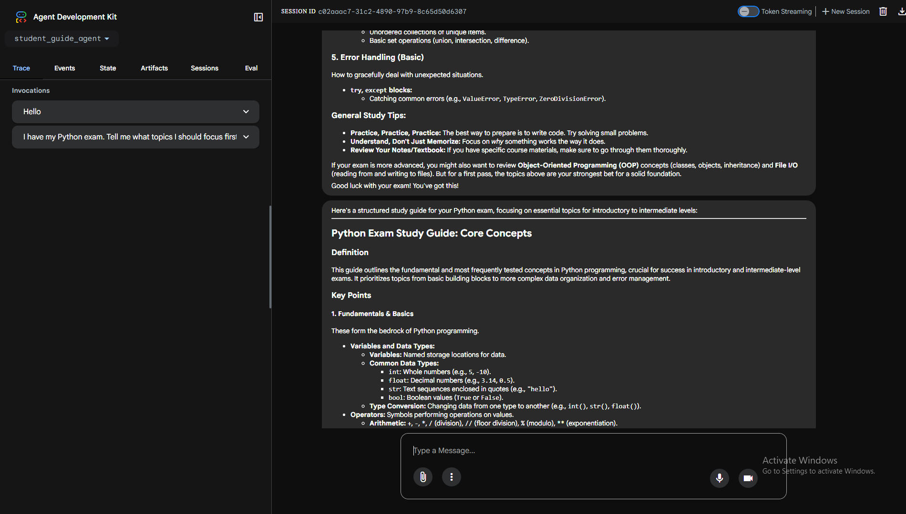
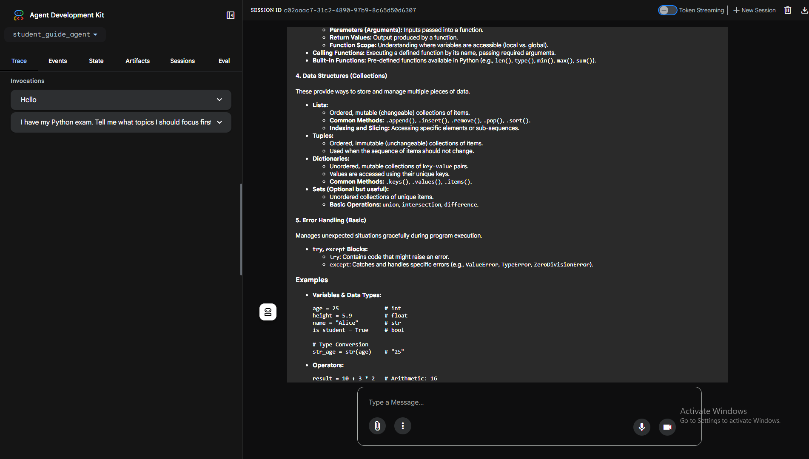
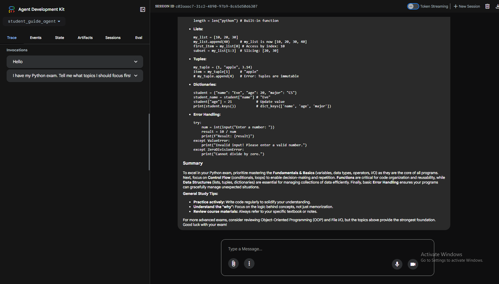

# 📘Student Guide AI Agent 

## 🚀 Project Overview
The Student Guide AI Agent is an AI-powered educational assistant designed to help students understand complex topics in a clear, structured and exam-ready format. Unlike traditional Q&A systems, this agent focuses on teaching rather than just answering. Built using Google ADK (Agent Development Kit) and Gemini, the system processes user queries and converts them into well-organized study notes, including -
* Definition.
* Key Points.
* Examples.
* Summary.

The agent is deployed as a scalable HTTP API on Google Cloud Run, making it easy to integrate into web apps, mobile apps or learning platforms.

📄 Google Cloud Run Link - https://student-guide-315961907444.europe-west1.run.app

## Quick Glance
<p align="center">
  <br>
  <br>
  <br>
  <br>
  <br>
</p>

## 🎯 Problem Statement
Build and deploy a single AI agent that -
* Uses ADK and Gemini.
* Performs one clearly defined task.
* Is deployed on Google Cloud Run.
* Exposes functionality via an HTTP API.

## 💡 Solution Idea
The Student Guide Agent acts as a smart, always-available tutor + note-maker.

### Key Concept -
Instead of returning long, unstructured answers, the agent -
1. Understands the student's query.
2. Fetches accurate information (via Gemini + optional Wikipedia API).
3. Converts it into clean, structured study notes.

### Example Query -
> "What is Machine Learning?"

### Output Format -
* Definition.
* Key Points.
* Examples.
* Summary.

This approach improves -
* Retention.
* Revision efficiency.
* Concept clarity.

## 🧠 Core Capabilities
* Converts natural language queries → structured study notes.
* Provides clear, concise and educational explanations.
* Maintains consistent formatting across all outputs.
* Supports external knowledge retrieval (Wikipedia).

## 🏗️ System Architecture
### 🔄 Workflow 
1. **User Input**
   * Student asks a question.

2. **Query Analysis**
   * Agent interprets intent using Gemini.

3. **Processing**
   * Retrieves knowledge (Gemini + optional APIs).

4. **Response Generation**
   * Formats output into structured notes -
     * Definition.
     * Key Points.
     * Examples.
     * Summary.

5. **Output Delivery**
   * Returned via HTTP API (Cloud Run).

## ⚙️ Tech Stack
| Component          | Technology           |
| ------------------ | -------------------- |
| Agent Framework    | Google ADK           |
| AI Model           | Gemini               |
| Backend Language   | Python               |
| Deployment         | Google Cloud Run     |
| API Interface      | HTTP REST API        |
| External Knowledge | Wikipedia API        |
| Logging            | Google Cloud Logging |
| Containerization   | Docker               |

## 📦 Features
* ✅ Accepts natural language queries.
* ✅ Generates structured study notes.
* ✅ Uses Gemini for intelligent reasoning.
* ✅ Provides clear concept explanations.
* ✅ Ensures consistent output format.
* ✅ Fast and concise responses.
* ✅ Deployable as an HTTP API.
* ✅ Modular ADK-based architecture.
* ✅ Supports external knowledge lookup.

## 🌟 Unique Value Proposition (USP)
### 🔹 Differentiation
* Not just a chatbot → educational assistant.
* Focus on learning clarity, not raw answers.

### 🔹 Problem Solving
* Simplifies complex topics.
* Saves time by combining -
  * Explanation + Notes.

### 🔹 Core Advantage
* Combines -
  * Personal tutor.
  * Automated note generator.

## 📊 Example Output Structure
```json
{
  "definition": "Machine Learning is a subset of AI...",
  "key_points": [
    "Learns from data",
    "Improves over time",
    "Uses algorithms"
  ],
  "examples": [
    "Netflix recommendations",
    "Spam email filtering"
  ],
  "summary": "ML enables systems to learn patterns and make predictions..."
}
```
## 🚀 Deployment Details
* Hosted on Google Cloud Run.
* Containerized using Docker.
* Exposed via HTTP API endpoint.

## 🔮 Future Enhancements
* 🎯 Adaptive learning based on student level.
* 📝 Quiz generation for practice.
* 📊 Progress tracking system.
* 🧩 Multi-agent expansion (planner + tutor + evaluator).
* 🎙️ Voice-based interaction.

## 📌 Build Criteria Alignment
| Requirement       | Status |
| ----------------- | ------ |
| ADK Used          | ✅      |
| Gemini Used       | ✅      |
| Single Task Agent | ✅      |
| HTTP Input/Output | ✅      |
| Cloud Deployment  | ✅      |

## 📢 Conclusion
The Student Guide AI Agent is a lightweight yet powerful AI system that transforms how students learn by delivering structured, easy-to-understand and exam-ready content.
It bridges the gap between -
* ❌ Raw AI answers. 
* ✅ Structured learning .
